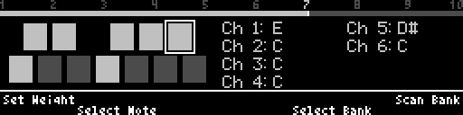

# Weighted Quantizer
A quantizer plug-in for the Disting NT Eurorack module with a few tricks up it's sleeve.

## What makes this different?

### Note Weightings

Instead of turning notes on and off like most quantizers, Weighted Quantizer instead assigns each note a weighting.  This weighting affects how strongly the incoming pitch CV is attracted to that particular note.  Let's look at an example.

Here the incoming CV on channel 5 is pretty close to to an E, and you can see that the value is in fact quantized to an E.

However now you you can see that I've lowered the weighting of the E somewhat, and now the incoming CV on channel 5 is more attracted to the D.

Finally, you can see that I've lowered the weighting of the E a bit further, as well as lowered the D a bit too, and now the same incoming CV is most attracted to the F!

To change the weightings, you can use the left encoder to select a note, and the left pot to change the weighting value.  And of course, each of the 12 note weightings is a Disting NT parameter, meaning you can add CV/MIDI/I2C mappings to some or all of them to evolve your scale over time!

Setting all chosen notes weightings to max will cause it to quantize evenly, as you would see in most other quantizers.  Setting all note weightings to zero turns off quantization altogether. 

### Banks

The numbers 1-10 across the top are banks of note weightings.  You can save any "weighted scales" you've created in those slots.  Here, you can see I've selected Bank 7, and now that same incoming CV on channel 5 is being quantizes to a D#.

The banks are defaulted to the following scales (all with full weightings):

| Bank | Scale |
|--------|--------|
| 1 | Ionian |
| 2 | Dorian |
| 3 | Phrygian |
| 4 | Lydian |
| 5 | Mixolydian |
| 6 | Aeolian |
| 7 | Locrian |
| 8 | Major Pentatonic |
| 9 | Minor Pentatonic |
| 10 | Chromatic |

To save your own "weighted scale" to a bank, use the right encoder to select a bank, and give it a long press to save.  To recall the values from another bank, just select that bank and give the encoder a short press!

If you are in the zone, and don't remember which bank has the scale you are looking for, you can navigate to a bank using the right encoder, and instead of pushing to load it, you can hold button 3 to "peek" at it, without actually loading it and affecting your jam!

All of your bank setting

### Bank Scanning

Now that we have saved all of our weighted scales to banks, the fun REALLY starts!  Press the right pot, and you turn on scanning mode.  Notice how the divider bar changes.  This is showing you your current scanning position.  Turn the right pot left and right, and notice how your note weightings smoothly change to the values you have saved in each bank!

Of course, the scan position is also a Disting NT parameter, so you can control that with CV/MIDI/I2C mappings to automate your scan to slowly change scales, or to instantly change banks!

## What else?

Now that's all the cool stuff out of the way, here's some of the more typical stuff Weighted Quantizer has that you might expect from Disting NT algorithms.

### Multiple channels

When adding the algorithm, you can choose between 1 and 8 channels.  You can also respecify the algorithm to change this later.

All channels are quantized by the same note weightings that you see on the UI.  So you can use them for different sections of your song (bass, pads, meoldy, etc.) and as you change your weighted scales, either manually or by selecting/scanninig banks, everything adjusts at once.

Each channel has the following Disting NT parameters:

| Parameter | Meaning |
|--------|--------|
| Input | Disting NT bus to get the incoming pitch CV from. |
| Trigger | Disting NT bus to trigger this channel to sample.  No trigger means this channel will quantize continuously. |
| Output | Disting NT bus to send the quantized CV to. |
| (Pre) Attenuate | Amount to attenuate the incoming CV by pre-quantization, in percent. |
| (Pre) Offset | Amount to offset the incoming CV by pre-quantization, in volts. |
| (Post) Transpose | Amount to transpose the post-quantization value by, in semitones. |

### Other Parameters

There is also a General parameter page, with the following parameters:

| Parameter | Meaning |
|--------|--------|
| Transpose All | Amount to transpose the post-quantization value by, in semitones.  This applies to ALL channels, and is added in addition to the per-channel transposition. |
| Bank Scan | The position of the bank scanner, as described above. |
| Trigger Samp. Delay | A slight delay between receiving a trigger to sample the CV, and actually sampling it.  This allows the CV to settle to the correct value, for scenarios when trigger and CV would otherwise change simultaneously |

Finally, there is a Note Weights parameter page, where each of the 12 notes have their weightings.  These a

| Parameter | Meaning |
|--------|--------|
| C | Note weighting for C, from 0-10 |
| C# | Note weighting for C#, from 0-10 |
| ... | ... |
| B | Note weighting for B, from 0-10 |

## Housekeeping

This plugin utilizes features in API version 10 of the Disting NT API.  This version is first supported in NT firmware version 1.12.  It was mostly developed against lower versions of the API and firmware, and may work with them, but I have not tested that.  The final API calls I needed are listed as baackwards compatible, but without them, CV mappings to channel-specific parameters may be confusing.

Here is a video I made a while back covering most of the functionality described above.

[Video](https://www.youtube.com/watch?v=RbKRSuCFE7E)

Bugs, PRs, etc on [GitHub](https://github.com/NerdRoger/disting_nt_plugins) or find me (AgentTerror) on the Expert Sleepers Discord.